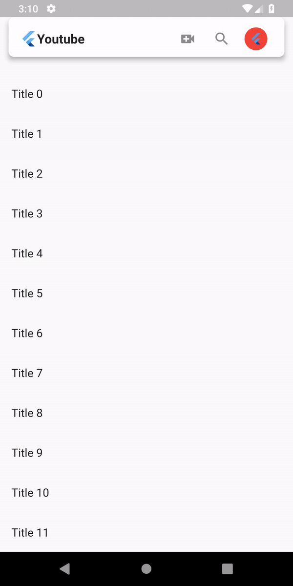

# rounded_floating_app_bar

Rounded floating app bar like new google applications has.
This package provides an easy way to add rounded corner floating app bar in Flutter project.

## Preview


## Installing
1. Add dependency to `pubspec.yaml`

    *Get the latest version in the 'Installing' tab on pub.dartlang.org*
    
```dart
dependencies:
    rounded_floating_app_bar: 0.1.0
```
2. Import the package
```dart
import 'package:rounded_floating_app_bar/rounded_floating_app_bar.dart';
```

3. Adding `RoundedFloatingAppBar` widget

```dart
RoundedFloatingAppBar(
  floating: true,
  snap: true,
),
```

## How to use

**Check out the example app** in the [example](example) directory or the 'Example' tab on pub.dartlang.org for a more complete example.

## Getting Started

This project is a starting point for a Dart
[package](https://flutter.io/developing-packages/),
a library module containing code that can be shared easily across
multiple Flutter or Dart projects.

For help getting started with Flutter, view our
[online documentation](https://flutter.io/docs), which offers tutorials,
samples, guidance on mobile development, and a full API reference.

## Contribute
1. Fork the the project
2. Create your feature branch (git checkout -b my-new-feature)
3. Make required changes and commit (git commit -am 'Add some feature')
4. Push to the branch (git push origin my-new-feature)
5. Create new Pull Request

## Questions?🤔

Hit me on

<a href="https://twitter.com/ibhavikmakwana"></a>
<a href="https://medium.com/@ibhavikmakwana"></a>
<a href="https://www.linkedin.com/in/ibhavikmakwana/"></a>

# Donate

> If you found this project helpful or you learned something from the source code and want to thank me, consider buying me a cup of :coffee:
>
> - [PayPal](https://www.paypal.me/ibhavikmakwana)
> - Google Pay **(bhavikmakwana43@okhdfcbank)**

## License

    Copyright (c) 2018 Bhavik Makwana

    Permission is hereby granted, free of charge, to any person obtaining a copy of this software and associated documentation files (the "Software"), to deal in the Software without restriction, including without limitation the rights to use, copy, modify, merge, publish, distribute, sublicense, and/or sell copies of the Software, and to permit persons to whom the Software is furnished to do so, subject to the following conditions:

    The above copyright notice and this permission notice shall be included in all copies or substantial portions of the Software.

    THE SOFTWARE IS PROVIDED "AS IS", WITHOUT WARRANTY OF ANY KIND, EXPRESS OR IMPLIED, INCLUDING BUT NOT LIMITED TO THE WARRANTIES OF MERCHANTABILITY, FITNESS FOR A PARTICULAR PURPOSE AND NONINFRINGEMENT. IN NO EVENT SHALL THE AUTHORS OR COPYRIGHT HOLDERS BE LIABLE FOR ANY CLAIM, DAMAGES OR OTHER LIABILITY, WHETHER IN AN ACTION OF CONTRACT, TORT OR OTHERWISE, ARISING FROM, OUT OF OR IN CONNECTION WITH THE SOFTWARE OR THE USE OR OTHER DEALINGS IN THE SOFTWARE.
